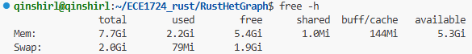
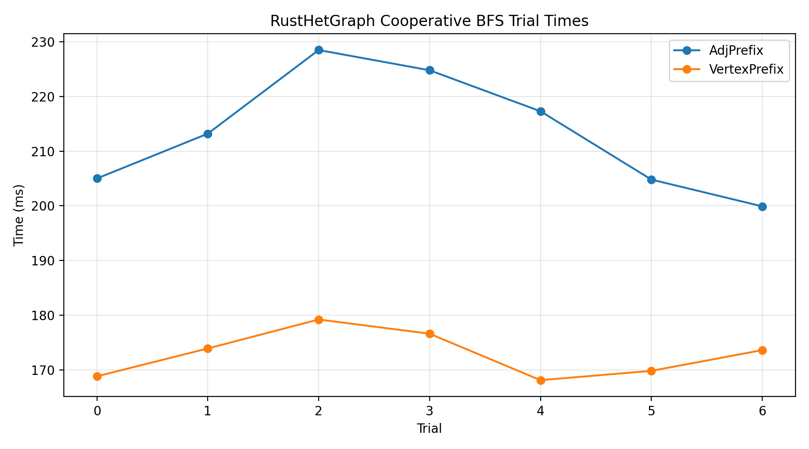
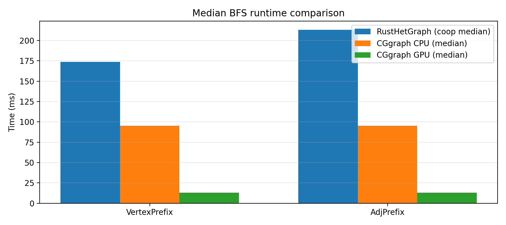

# RustHetGraph: A Rust-Based CPU–GPU Graph Processing Prototype

A prototype project that explores **heterogeneous graph processing in Rust**, inspired by CGgraph-style ideas: CSR-based graph representation, locality-aware preprocessing, GPU-resident subgraph handling, and **cooperative BFS across CPU and GPU**.

> Status note: This is a **prototype**, not a production-grade engine. The main value is the architecture exploration, correctness checks, and reproducible runs (especially for cooperative BFS), rather than absolute performance leadership.

---

## Team Members

* **Shirley Qin** - *Student #*: 1004555297 - Email: `shirley.qin@mail.utoronto.ca`
* **Guanqun Dong** - *Student #*: 1004525301 - Email: `guanqun.dong@mail.utoronto.ca`

---

## Motivation

Large-scale graph analytics (web/social graphs) increasingly depend on heterogeneous CPU–GPU systems. GPUs offer high throughput, but in practice performance is often constrained by:

1. **GPU memory capacity** (full graphs frequently do not fit in device memory), and
2. **CPU-GPU transfer overhead** (PCIe) and underutilization when work partitioning is static.

Prior work [**CGgraph**](https://www.vldb.org/pvldb/vol17/p1405-yuan.pdf) demonstrates that carefully designed **data layout**, **subgraph residency**, and **dynamic co-processing** can outperform naive CPU-only or GPU-only approaches.

Our motivation was twofold:

* **Systems motivation:** Learn and prototype the core heterogeneous ideas (subgraph residency + cooperative scheduling) in a minimal research-style codebase.
* **Rust ecosystem motivation:** Explore how far we can push a CPU–GPU graph pipeline using Rust’s safety model and modern tooling, while still touching low-level GPU integration.

---

## Objectives

Our project objective is to implement a **Rust-based prototype** that demonstrates core heterogeneous graph-processing components and enables experimental evaluation on real graphs. Concretely:

* Implement a CSR-based graph representation and supporting graph utilities.
* Implement BFS baselines and a **cooperative CPU–GPU BFS** pipeline (**primary deliverable**).
* Implement GPU-side kernels and Rust-CUDA integration to support frontier expansion / related primitives.
* Provide reproducible commands for building and running on an instructor’s machine.


## Features

### Implemented

1. **CSR-Based Graph Representation and Utilities**
   The project provides a CSR (Compressed Sparse Row)–based graph representation designed for large-scale graphs. Supporting utilities enable graph loading, validation, reordering, partitioning, and basic structural analysis. This infrastructure serves as the foundation for both CPU-only and heterogeneous graph algorithms.

2. **CPU BFS Baseline**
   A standard breadth-first search (BFS) implementation is provided as a correctness reference and baseline for comparison against heterogeneous execution. This baseline ensures that results produced by more complex execution modes can be validated.

3. **GPU Kernels and Rust–CUDA Integration (Prototype)**
   The system includes prototype CUDA kernels for graph-related primitives and a Rust–CUDA integration layer that manages kernel loading, memory transfers, and device execution. This layer enables offloading selected graph operations to the GPU and forms the basis for cooperative execution.

4. **Cooperative CPU–GPU BFS (Primary Contribution)**
   The main feature of the project is a cooperative BFS that dynamically splits frontier processing between CPU and GPU. The design allows GPU-resident subgraphs to accelerate traversal while the CPU handles remaining work, demonstrating a heterogeneous execution model for graph traversal.

5. **Correctness Verification Tools**
   Dedicated utilities are provided to validate BFS correctness across different execution modes. These tools are used to ensure that cooperative CPU–GPU traversal produces results consistent with the CPU baseline.

### Planned but Not Fully Delivered

* Additional graph algorithms such as PageRank (PR) and Weakly Connected Components (WCC), as well as a more complete CGgraph-style evaluation pipeline, were planned but not fully implemented.
* While functional and correct, the cooperative execution strategy was not exhaustively optimized, and achieving peak performance across all datasets was beyond the project timeline.


## Developer / User Guide

RustHetGraph is organized as a **research-style heterogeneous graph processing prototype**. Functionality is exposed primarily through **binary executables under `src/bin/`**, with algorithm logic under `src/alg/`, GPU runtime support under `src/gpu/`, and graph preprocessing utilities under `src/graph/`.

The project was developed incrementally; as a result, multiple binaries exist to support correctness checking, performance evaluation, and GPU kernel exploration.

---

### Primary user-facing execution paths

These binaries represent the **recommended and fully functional ways to run the system**.

#### Cooperative CPU–GPU BFS (core) `src/alg/bfs_coop.rs`
**Runnable via:**
* `src/bin/check_bfs_correctness.rs` (general, correctness-focused)
* `src/bin/compare_bfs.rs` (dataset-specific evaluation)

The cooperative BFS executes a **level-synchronous traversal** in which frontier expansion is dynamically split between CPU and GPU:

* A GPU-resident **subgraph** (bounded by edge budget and per-vertex caps) handles high-throughput expansion.
* Residual vertices and edges not covered by the GPU subgraph are expanded on the CPU.
* Per-level scheduling logic determines when GPU execution is beneficial and merges CPU/GPU results into the next frontier.

The BFS engine is encapsulated in `CoopBfsPlan`, which owns host/device buffers, CUDA modules, and execution state across levels.

---

#### BFS correctness validation  `src/bin/check_bfs_correctness.rs`

Runs a **CPU reference BFS** and a **cooperative BFS** on the same input graph and verifies exact agreement of distance results. This binary is the primary correctness gate for heterogeneous execution and is recommended before running performance experiments.

---

#### GPU runtime sanity check `src/bin/gpu_smoke.rs`

Validates the Rust-CUDA execution pipeline independently of BFS logic. It initializes CUDA, loads PTX modules, launches a simple kernel, and verifies device-to-host memory correctness. This binary isolates environment/runtime failures from algorithmic issues.

---

### Supporting and exploratory binaries

The following binaries reflect **incremental development and targeted experimentation**. They are retained to document design exploration and enable focused debugging but are not required for typical use.

* **Frontier expansion kernel variants**
  (`gpu_bfs_expand*`)
  Isolate GPU frontier expansion behavior under different strategies (atomic updates, visited marking, etc.).

* **GPU BFS loop and benchmark prototypes**
  (`gpu_bfs_loop*`, `gpu_bfs_bench`)
  Explore GPU-centric BFS loop structure and timing characteristics prior to cooperative integration.

* **GPU primitive experiments**
  (`gpu_degree`)
  Validate degree-related kernels and device memory layout assumptions.

* **Dataset-specific runners**
  (`compare_bfs`)
  Execute cooperative BFS on a fixed dataset configuration for repeatable evaluation.

---

### Relevant source modules for developers

Developers extending or modifying the system should focus on:

* **Cooperative BFS engine:** `src/alg/bfs_coop.rs`
* **CPU BFS baseline:** `src/alg/bfs.rs`
* **GPU runtime + device subgraph management:** `src/gpu/`
* **CSR representation and preprocessing utilities:** `src/graph/`

Exact build commands, runtime arguments, and dataset setup are documented in the **Reproducibility Guide**.

---

### Note on `gpu_cpu_bfs_coop.rs`

The binary `src/bin/gpu_cpu_bfs_coop.rs` represents an **intended generic entry point** for cooperative BFS and reflects iterative development. In the current version, cooperative BFS is reliably executed through the correctness and dataset-specific runners listed above.


## Reproducibility Guide

All experiments were conducted on a **Linux PC with an NVIDIA GPU**. The project supports both **CPU-only** execution and **CUDA-accelerated** execution. The **primary results** use the CUDA path.

---

### 1) Environment

**Required**

* Linux (Ubuntu recommended)
* NVIDIA GPU
* NVIDIA driver + CUDA toolkit

Verify:

```bash
nvidia-smi
nvcc --version
```

---

### 2) Clone and build

```bash
git clone https://github.com/qinshirl/RustHetGraph.git
cd RustHetGraph
cargo build --release
```

---

### 3) Dataset format and conversion (edge list to CSR)

RustHetGraph operates on graphs stored in a **CSR binary format**.

* **Raw input**: edge list text files (one edge per line)
* **Converted output**: CSR binaries (offsets + adjacency arrays)

A dedicated conversion tool is provided:

* **Edge list to CSR converter**: `edge_list_to_csr/src/main.rs`

This converter produces CSR files compatible with:

* RustHetGraph, and
* the original CGgraph implementation.

If CSR binaries already exist, this step can be skipped.

---
### 4) CUDA runtime sanity check

Before running BFS workloads:

```bash
cargo run --release --bin gpu_smoke
```

* **Binary**: `src/bin/gpu_smoke.rs`
* **Purpose**: validates CUDA context creation, PTX loading, and kernel launch
---

### 5) CPU baseline and correctness checking 

```bash
cargo run --release --bin check_bfs_correctness -- <CSR_DIR>
```

* **Binary**: `src/bin/check_bfs_correctness.rs`
* **Required argument**:

  * `<CSR_DIR>`: directory containing CSR binary files (generated by the edge-list-to-CSR converter)
* **Purpose**:

  * runs CPU BFS and cooperative CPU–GPU BFS
  * verifies that computed distances match

All BFS-related binaries in this project expect a CSR graph directory as their first positional argument.


---

### 6) Cooperative CPU–GPU BFS (core)

The primary cooperative BFS runner is:

```bash
cargo run --release --bin compare_bfs -- \
  <CSR_DIR> <ROOT> <EDGE_BUDGET> <PER_VERTEX_CAP> \
  --policy <vertex-prefix | adj-prefix> \
  [--cg-cpu <CG_CPU_BIN>] [--cg-gpu <CG_GPU_BIN>]
```

* **Binary**: `src/bin/compare_bfs.rs`
* **CSR input location**: directory produced by the CSR converter
* **ROOT**: BFS root vertex ID
* **EDGE_BUDGET**: maximum edges processed per iteration
* **PER_VERTEX_CAP**: adjacency cap per vertex on GPU
#### Optional CGgraph comparison

RustHetGraph can optionally compare BFS results against outputs generated by the original CGgraph implementation.

* **CPU comparison input**: `--cg-cpu <CG_CPU_BIN>`
* **GPU comparison input**: `--cg-gpu <CG_GPU_BIN>`

**Expected format**:

* Binary files containing BFS distance outputs
* Generated externally by CGgraph using the same CSR graph and root

If these flags are omitted, RustHetGraph runs independently with no external dependencies.

---

### 7) GPU subgraph policies

The `--policy` flag controls how the GPU subgraph is constructed:

* **`vertex-prefix`**
The GPU subgraph contains the full adjacency lists of a prefix of vertices (after reordering). All edges of these vertices are expanded on the GPU, while vertices outside the prefix are handled entirely on the CPU. This policy favors vertex locality and produces predictable GPU workloads, but may underutilize the GPU if high-degree vertices lie outside the prefix.

* **`adj-prefix`**
The GPU subgraph contains a bounded prefix of the global adjacency stream, up to the edge budget. As a result, a vertex’s adjacency list may be partially GPU-resident, with remaining neighbors expanded on the CPU. This policy favors edge coverage under tight GPU memory budgets and can better capture high-degree vertices, but often causes later BFS levels to become CPU-dominated.

In both cases, BFS is executed cooperatively: GPU expansion is attempted first, and any remaining frontier or residual edges are processed on the CPU within the same BFS level.


## Datasets

RustHetGraph operates on graphs stored in **CSR (Compressed Sparse Row) binary format**.
All datasets originate from **edge-list text files** and are converted into CSR binaries before use.

---

### CSR conversion format

The edge-list to CSR conversion step produces the following binary files:

* `*_csrOffset_u32.bin` - CSR row pointer array
* `*_csrDest_u32.bin` - CSR adjacency list
* `*_csrWeight_u32.bin` - edge weights (if present; otherwise defaulted)

These files together define the CSR graph representation used by RustHetGraph.

The conversion is performed by:

* **Edge list → CSR tool**: `edge_list_to_csr/src/main.rs`

The resulting CSR format is compatible with both **RustHetGraph** and the original **CGgraph** pipeline.

---

### Twitter-2010 dataset

* **Source**: [Stanford Network Analysis Project (SNAP)](https://snap.stanford.edu/data/twitter-2010.html)
* **Type**: Social network (directed)
* **Original size**:

  * ≈ 41.6 million vertices
  * ≈ 1.47 billion edges

The full Twitter-2010 graph is too large to preprocess on the experimental machine due to memory constraints during CSR reordering and ranking stages.
To enable feasible experimentation, we used a **downsampled subset (~1/10 of the original graph)**, referred to as `twitter-2010_partsmall`.

This subset preserves realistic graph structure while remaining within system memory limits.

---

### Web-Google dataset

* **Source**: [Google web graph](https://snap.stanford.edu/data/web-Google.html)
* **Type**: Web hyperlink graph
* **Size**:

  * ≈ 875 thousand vertices
  * ≈ 5.1 million edges

The Web-Google dataset was used for early testing, correctness validation, and small-scale experiments.

---

### Memory constraints and downsampling rationale

The experimental machine has limited memory resources:



During preprocessing (particularly CGgraph-style rank and reorder phases), memory usage scales with both vertex and edge counts.
For the Twitter-2010 dataset:

* The original (`twitter-2010`, ≈1.47B edges) exceeds available memory, causing the kernel to terminate the process due to out-of-memory (OOM) conditions.
* The smaller subset (`twitter-2010_partsmall`) reduces peak memory usage sufficiently to complete preprocessing and BFS execution.

This limitation motivated the use of a reduced dataset for reproducible evaluation.


## Performance Evaluation (BFS)

**Raw results.**
Complete terminal outputs-including per-trial timings, frontier statistics, and parsed CGgraph reference logs-are stored in `results_log/`.

---

### Experimental setup

We evaluate the cooperative **CPU–GPU BFS** implementation using the `compare_bfs` binary on the `twitter-2010_partsmall` dataset with fixed parameters:

* Root vertex: `0`
* Edge budget: `50,000,000`
* Per-vertex cap: `4096`
* Trials: `7` (median reported)

The GPU subgraph is constructed and uploaded once per run. A warm-up execution precedes timed trials to amortize initialization costs.

Dataset statistics reported by the binary:

* Vertices: `n = 41,652,219`
* Edges: `m = 146,836,488`
* GPU-resident edges: `edges_on_gpu ≈ 0.3405`

Optional CGgraph CPU and GPU BFS binaries are executed on the same input for reference comparison.

---

### Policies evaluated

* **VertexPrefix**
  GPU subgraph induced by a prefix of reordered vertices.

* **AdjPrefix**
  GPU subgraph induced by a prefix of the reordered adjacency stream up to the edge budget.

These policies lead to different effective traversal depths and workloads.

---

### Results summary (median over trials)

| Policy       | Coop BFS median (ms) | Reached vertices | Max depth | Levels |  GPU edges | CG CPU median (ms) | CG GPU median (ms) |
| ------------ | -------------------: | ---------------: | --------: | -----: | ---------: | -----------------: | -----------------: |
| VertexPrefix |              173.667 |          500,228 |         1 |      2 | 49,998,721 |             95.355 |             12.930 |
| AdjPrefix    |              213.275 |        1,851,350 |        19 |     20 | 50,000,000 |             95.355 |             12.930 |


## Frontier dynamics and GPU utilization

### Frontier split by BFS level (AdjPrefix)


This figure reports the size of the BFS frontier at each level under the `AdjPrefix` policy, decomposed into GPU-processed and CPU-processed vertices.
1. **Rapid early expansion with partial GPU coverage.**
   The first two BFS levels exhibit a large frontier (peaking at ~500K vertices), with a non-trivial fraction processed on the GPU. This corresponds to traversal within the GPU-resident adjacency prefix.

2. **Abrupt GPU frontier exhaustion.**
   After approximately level 2, the GPU frontier collapses to zero despite the BFS continuing for many additional levels. From this point onward, all frontier expansion is handled exclusively by the CPU.

This indicates that while the GPU subgraph contains a fixed budget of edges, its **topological coverage of the BFS wavefront is shallow** under `AdjPrefix`. Once the traversal escapes the induced adjacency prefix, no further GPU acceleration is possible.

---

### GPU fraction of frontier by level (AdjPrefix)


This plot normalizes the previous result by showing the **fraction of the frontier processed on the GPU** at each BFS level.
* GPU participation starts at **100% at level 0**, as the root vertex necessarily lies within the GPU subgraph.
* GPU share drops sharply at level 1 and becomes effectively **zero beyond level 2**.
* No recovery in GPU utilization occurs at deeper levels.

This behavior highlights a fundamental limitation of static subgraph selection: **GPU acceleration is front-loaded and short-lived**. The cooperative BFS effectively degenerates into a CPU-only traversal for the majority of the BFS depth under this policy.

---

## Runtime stability and policy comparison

### Per-trial runtime variability



* **VertexPrefix consistently outperforms AdjPrefix** across all trials.
* Runtime variance is modest for both policies, indicating stable execution after warm-up.
* `AdjPrefix` exhibits a higher absolute runtime and slightly larger variance, reflecting increased CPU-side work and deeper traversal.

---

## Comparison with CGgraph baselines

### Median BFS runtime comparison



This figure compares median runtimes of RustHetGraph cooperative BFS against CGgraph CPU and GPU BFS implementations for both policies.

Interpretation:

* **CGgraph GPU BFS** is an order of magnitude faster than RustHetGraph, reflecting its tightly optimized, GPU-centric design with minimal CPU involvement.
* **CGgraph CPU BFS** also outperforms RustHetGraph, indicating that the cooperative pipeline currently incurs overheads beyond pure traversal cost.
* RustHetGraph shows a clear **policy-dependent performance gap**, with `AdjPrefix` substantially slower than `VertexPrefix`.

These results confirm that RustHetGraph’s performance is not limited by raw GPU throughput but by **coordination overheads and incomplete GPU coverage of the traversal**.

---

## Discussion and takeaways

### Policy-dependent traversal cost

`AdjPrefix` reaches nearly **4× more vertices** and explores an order of magnitude more BFS levels than `VertexPrefix`. Consequently, runtime comparisons across policies do **not correspond to equal computational work**. The deeper traversal under `AdjPrefix` explains its higher runtime despite identical GPU edge budgets.

### GPU utilization collapse

Under `AdjPrefix`, GPU acceleration is effective only in the earliest BFS levels. Once the frontier exits the GPU-resident subgraph, traversal devolves into CPU-only execution with no mechanism for re-engaging the GPU. This exposes a key limitation of static, prefix-based subgraph selection.

### Sources of overhead

The cooperative pipeline is dominated by:
* Kernel launch and synchronization costs,
* CPU–GPU frontier partitioning,
* Residual CPU expansion for vertices not covered by the GPU subgraph.

As a result, overall performance is governed more by **orchestration overhead and policy effectiveness** than by GPU compute capability.

### Key takeaway

RustHetGraph successfully demonstrates a **configurable CPU–GPU cooperative BFS** with explicit policy control over GPU subgraph selection. While it does not yet approach CGgraph’s performance, the results clearly identify where optimization effort should be focused: improving GPU subgraph coverage across BFS depth, enabling dynamic repartitioning, and overlapping CPU and GPU work.


## Contributions by Each Team Member

### Shirley Qin

* Implemented and iterated on the **cooperative BFS pipeline** and the main runner.
* Implemented/maintained BFS correctness checks and evaluation runners
* Integrated and debugged Rust-CUDA runtime flows (module loading, GPU buffers, frontier movement) across multiple test binaries.
* Implemented core CSR graph utilities and supporting graph modules(CSR, stats, reorder/permutation helpers, I/O helpers).

### Guanqun Dong
* Implemented baseline algorithms and early profiling/benchmark scaffolding.(graphloader branch)
* Supported experimental setup and assisted in performance evaluation scripting / dataset preparation.

---

## Lessons Learned and Concluding Remarks

1. **Correctness-first is essential in heterogeneous graph processing.**
   Coordinating frontier expansion across CPU and GPU exposes subtle failure modes-duplicate visits, race conditions in frontier marking, and offset misalignment in partial adjacency expansion. Systematic correctness checks against CPU baselines were therefore mandatory before any performance evaluation.

2. **Data movement and scheduling dominate earlier than expected.**
   While individual CUDA kernels achieved low per-level latency, overall runtime was strongly influenced by CPU–GPU transfers, frontier partitioning, and subgraph construction overheads. This reinforces that heterogeneous graph performance is primarily a *systems problem*, not just a kernel optimization problem.

3. **Rust improves structure and safety, but does not eliminate GPU complexity.**
   Rust’s ownership model and modular abstractions simplified CSR handling, graph reordering, and baseline validation. However, CUDA interoperability still requires explicit control over device buffers, synchronization points, and memory lifetimes, where correctness remains largely the developer’s responsibility.

4. **Effective performance tuning requires workload-aware policies.**
   The observed differences between `vertex-prefix` and `adj-prefix` policies highlight that no single GPU subgraph strategy dominates across workloads. Frontier growth rate, degree distribution, and memory budget jointly determine whether GPU execution meaningfully accelerates BFS.

**Conclusion.**
RustHetGraph demonstrates a functional, reproducible heterogeneous BFS pipeline that integrates CSR preprocessing, GPU subgraph extraction, and cooperative CPU–GPU execution. Although its performance does not yet surpass a highly optimized GPU-native system such as CGgraph, the project establishes a clear experimental baseline and exposes the key architectural trade-offs involved. The codebase is designed to support future extensions, including improved frontier compaction, adaptive policy selection, and broader algorithm coverage beyond BFS.

---

### [Video Slide Presentation](https://drive.google.com/file/d/1qwxWpOC_2OQLKO1HSOyhyvfoIzzNa5sz/view?usp=sharing())
### [Video Demo](https://drive.google.com/file/d/1dB4G-oPC6hwYYpAd7ZhOiN2A5k620UKV/view?usp=sharing)

